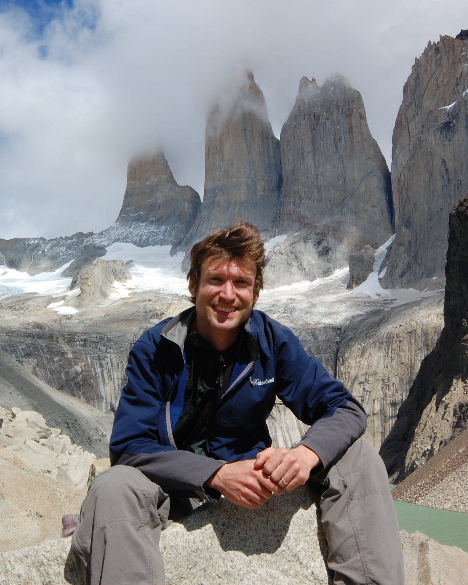
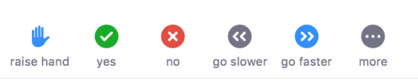
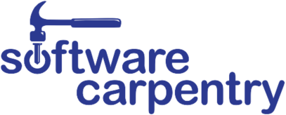

# .right[Brett Longworth]

.pull-left[]

.pull-right[

Research Associate, Geology and Geophysics

**Research Interests:** Accelerator Mass Spectrometry, radiocarbon, data mining for method development, links between the marine and terrestrial carbon cycle.

**Fun fact:** Number of living things I take care of has gone up by billions since the pandemic. Mostly sourdough. Some chickens.

]

---

# .right[Joe Futrelle]

.pull-left[]

.pull-right[

Software Engineer at WHOI

**Research Interests:** Open science, open data, databases, data-intensive computing, machine learning, software engineering best practices

**Fun fact:** I was a bassist for the 90s space-rock band Hum

]

---

# .right[Audrey Mickle]

.pull-left[]

.pull-right[

Software Engineer at WHOI

**Research Interests:** Open science, open data, databases, data-intensive computing, machine learning, software engineering best practices

**Fun fact:** I was a bassist for the 90s space-rock band Hum

]

---

# .right[Lyndsey Lefebvre]

.pull-left[]

.pull-right[

Software Engineer at WHOI

**Research Interests:** Open science, open data, databases, data-intensive computing, machine learning, software engineering best practices

**Fun fact:** I was a bassist for the 90s space-rock band Hum

]

---

# .right[Kodiak Firesmith]

.pull-left[]

.pull-right[

Software Engineer at WHOI

**Research Interests:** Open science, open data, databases, data-intensive computing, machine learning, software engineering best practices

**Fun fact:** I was a bassist for the 90s space-rock band Hum

]

---

# Course website

https://blongworth.github.io/2021-06-02-WHOI-SQL/

---

# Getting help and giving feedback

We are here to help! Raise your hand and a helper or instructor will message you in the chat. If it can't be solved via chat you and the helper will move to a breakout room to talk through the problem.

We'll also ask for input and feedback often. Use "yes" and "no" in the participants window. Coffee break indicator also welcome, but we've got a lot to cover!

---

# Code of Conduct

We are dedicated to providing a welcoming and supportive environment for all people, regardless of background or identity. Any form or behavior to exclude, intimidate, or cause discomfort is a violation of the Code of Conduct. In order to foster a positive and professional learning environment we encourage the following kinds of behavior in all platforms and events:

* Use welcoming and inclusive language
* Be respectful of different viewpoints and experiences
* Gracefully accept constructive criticism
* Focus on what is best for the community
* Show courtesy and respect towards other community members

---

class: center, middle

.footnote[The Carpentries: https://carpentries.org/]

---

class: center, middle

# Thanks!

Slides created via the R package [**xaringan**](https://github.com/yihui/xaringan).

The chakra comes from [remark.js](https://remarkjs.com), [**knitr**](http://yihui.org/knitr), and [R Markdown](https://rmarkdown.rstudio.com).

